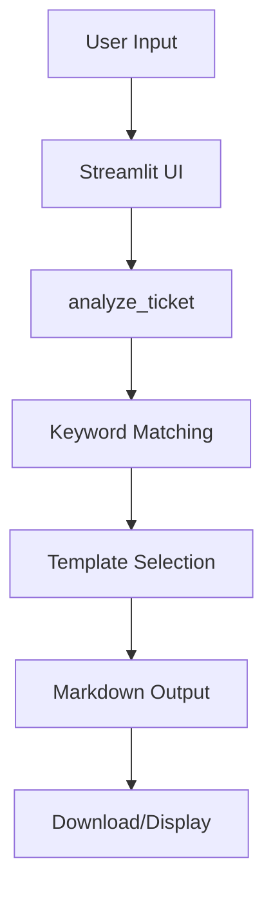
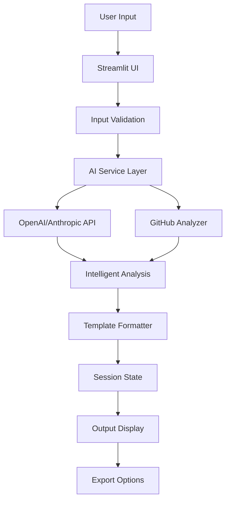

# Ticket2Fix: 48-Hour Hackathon MVP Improvement Plan

## Executive Summary

**Ticket2Fix** is a Streamlit-based web application that converts vague support tickets into structured, developer-ready tasks. The current implementation uses **rule-based keyword matching** with hardcoded templates, making it functional for a demo but lacking the AI intelligence it claims to provide.

**Critical Finding**: Despite being marketed as "AI-powered by IBM Bob", the application currently uses **zero AI** - only simple `if word in text` keyword matching.

---

## Architecture Overview

### Current System Design



### Component Breakdown

| Component | File | Lines | Purpose | Current Implementation |
|-----------|------|-------|---------|----------------------|
| **UI Layer** | [`app.py`](app.py) | 256 | Streamlit interface & orchestration | ✅ Well-structured |
| **Ticket Analyzer** | [`src/ticket_analyzer.py`](src/ticket_analyzer.py) | 69 | Severity estimation & summary | ❌ Keyword-only |
| **Repo Context** | [`src/repo_context.py`](src/repo_context.py) | 100 | Identify affected code areas | ❌ Hardcoded files |
| **Task Generator** | [`src/task_generator.py`](src/task_generator.py) | 56 | Create developer tasks | ❌ Static template |
| **Test Generator** | [`src/test_generator.py`](src/test_generator.py) | 56 | Generate test plans | ❌ Static template |

---

## Main Workflow Analysis

### Current Flow

1. **Input Collection**
   - User enters support ticket text (required)
   - User optionally provides project context (currently unused)
   - User selects from 3 sample tickets or writes custom

2. **Analysis Pipeline**
   ```python
   # Severity Detection (ticket_analyzer.py:1-22)
   if "password" in text or "login" in text:
       return "High"
   elif "error" in text or "not working" in text:
       return "Medium"
   else:
       return "Low"
   ```

3. **Template Selection**
   - Matches keywords to predefined categories (auth, payment, upload)
   - Returns hardcoded template with minimal customization
   - Only ticket text is inserted into template

4. **Output Generation**
   - Combines all sections into markdown
   - Provides download button
   - No actual AI processing occurs

### Critical Workflow Issues

❌ **No AI Integration**: Despite IBM Bob branding, zero AI is used  
❌ **Static Templates**: Same output structure regardless of ticket complexity  
❌ **Unused Context**: Project context input is collected but ignored  
❌ **No Repository Analysis**: Suggests fake file paths like `backend/auth.service.js`  
❌ **Limited Patterns**: Only recognizes 3 ticket types (auth, payment, upload)

---

## How It Converts Tickets (Current State)

### Example: Authentication Issue

**Input:**
> "After resetting password, users cannot log in. The page refreshes but does not show an error message."

**Processing:**
1. Detects "password" and "login" keywords
2. Selects authentication template
3. Returns hardcoded suggestions:
   - Files: `backend/auth.service.js`, `frontend/LoginForm.tsx`
   - Tests: "Login succeeds after password reset"
   - Debugging: "Check token generation logic"

**Problem**: These files don't exist in the user's repository! The suggestions are generic templates, not actual analysis.

---

## Critical Weaknesses

### 🚨 Priority 1: Fundamental Issues

#### 1. **No Real AI** (Severity: CRITICAL)
- **Current**: Simple keyword matching (`if "password" in text`)
- **Claimed**: "AI-powered by IBM Bob"
- **Impact**: Cannot understand context, nuance, or complex scenarios
- **Evidence**: All 4 source files use only `text.lower()` and `if word in text`

#### 2. **Hardcoded Templates** (Severity: HIGH)
- **Current**: Static templates with minimal customization
- **Impact**: Generic, repetitive responses
- **Example**: [`task_generator.py`](src/task_generator.py:2-56) returns identical structure for all tickets

#### 3. **Fake Repository Analysis** (Severity: HIGH)
- **Current**: Suggests non-existent files like `backend/auth.service.js`
- **Impact**: Misleading developers with incorrect file paths
- **Evidence**: [`repo_context.py`](src/repo_context.py:16-23) has hardcoded file lists

#### 4. **Limited Pattern Recognition** (Severity: MEDIUM)
- **Current**: Only 3 ticket types recognized (auth, payment, upload)
- **Impact**: Falls back to generic template for most tickets
- **Evidence**: [`ticket_analyzer.py`](src/ticket_analyzer.py:4-12) has 15 total keywords

### 📊 Secondary Issues

- No input validation or error handling
- Project context input is collected but never used
- No session state or history tracking
- No real-time feedback during processing
- No customization options for output format

---

## 48-Hour Hackathon Improvement Plan

### Time Budget: 20 Hours (28 hours buffer for testing/polish)

---

### 🔴 Phase 1: Critical Fixes (8 hours) - MUST HAVE

#### 1.1 Add Real AI Integration (4 hours)
**Goal**: Replace keyword matching with actual AI analysis

**Implementation**:
```python
# New file: src/ai_service.py
import openai  # or anthropic

def analyze_with_ai(ticket_text, project_context):
    prompt = f"""
    Analyze this support ticket and provide:
    1. Severity (Critical/High/Medium/Low) with reasoning
    2. Affected system areas
    3. Likely root causes
    4. Specific debugging steps
    
    Ticket: {ticket_text}
    Project Context: {project_context}
    """
    response = openai.chat.completions.create(
        model="gpt-4",
        messages=[{"role": "user", "content": prompt}]
    )
    return response.choices[0].message.content
```

**Files to Modify**:
- Create `src/ai_service.py` - AI integration layer
- Update [`src/ticket_analyzer.py`](src/ticket_analyzer.py) - Use AI instead of keywords
- Update [`src/repo_context.py`](src/repo_context.py) - AI-powered file suggestions
- Update [`src/task_generator.py`](src/task_generator.py) - Dynamic generation
- Update [`src/test_generator.py`](src/test_generator.py) - Context-aware tests
- Update [`app.py`](app.py) - Add API key configuration

**Expected Outcome**: Intelligent, context-aware analysis instead of templates

---

#### 1.2 Improve UI/UX (2 hours)
**Goal**: Make demo impressive and professional

**Enhancements**:
- Add loading spinner with progress messages
- Show step-by-step analysis progress
- Add success/error notifications
- Improve visual hierarchy with better styling
- Add copy-to-clipboard for each section
- Add dark mode toggle

**Files to Modify**:
- [`app.py`](app.py:188-256) - UI enhancements

**Code Example**:
```python
with st.spinner("🔍 Analyzing ticket severity..."):
    severity = analyze_severity(ticket)
    st.success(f"✅ Severity: {severity}")

with st.spinner("🗂️ Identifying affected areas..."):
    areas = find_affected_areas(ticket)
    st.success(f"✅ Found {len(areas)} affected areas")
```

---

#### 1.3 Add Input Validation (1 hour)
**Goal**: Prevent errors and improve reliability

**Implementation**:
```python
def validate_ticket(ticket_text):
    if not ticket_text or len(ticket_text.strip()) < 10:
        raise ValueError("Ticket must be at least 10 characters")
    if len(ticket_text) > 5000:
        raise ValueError("Ticket too long (max 5000 characters)")
    return ticket_text.strip()
```

**Files to Modify**:
- [`app.py`](app.py:231-236) - Add validation before analysis

---

#### 1.4 Enhanced Sample Tickets (1 hour)
**Goal**: Better demonstrate AI capabilities

**New Samples**:
```python
SAMPLE_TICKETS = {
    "Authentication issue": "...",  # existing
    "Payment issue": "...",  # existing
    "Upload issue": "...",  # existing
    "Performance degradation": "Dashboard loads slowly after 5pm...",
    "Security vulnerability": "Users can access other users' data...",
    "Data inconsistency": "Order totals don't match invoice amounts...",
    "Mobile responsiveness": "Buttons are cut off on iPhone 12...",
    "API timeout": "Third-party integration times out randomly..."
}
```

**Files to Modify**:
- [`app.py`](app.py:9-19) - Expand SAMPLE_TICKETS

---

### 🟡 Phase 2: High-Value Features (6 hours) - SHOULD HAVE

#### 2.1 GitHub Integration (3 hours)
**Goal**: Analyze real repositories for accurate file suggestions

**Implementation**:
```python
# New file: src/github_analyzer.py
import requests

def analyze_github_repo(repo_url):
    # Fetch repo structure via GitHub API
    # Analyze file patterns and naming conventions
    # Return actual file paths and tech stack
    pass
```

**Features**:
- Fetch repository structure via GitHub API
- Analyze file patterns (controllers, services, components)
- Identify tech stack from package.json, requirements.txt, etc.
- Suggest actual file paths based on repo structure
- Cache results to avoid rate limits

**Files to Modify**:
- Create `src/github_analyzer.py`
- Update [`src/repo_context.py`](src/repo_context.py) - Use real repo data
- Update [`app.py`](app.py:220-224) - Add GitHub URL input field

---

#### 2.2 Ticket History & Comparison (2 hours)
**Goal**: Allow users to track and compare analyses

**Implementation**:
```python
# In app.py
if 'history' not in st.session_state:
    st.session_state.history = []

# After analysis
st.session_state.history.append({
    'timestamp': datetime.now(),
    'ticket': ticket,
    'analysis': analysis
})

# Sidebar
with st.sidebar:
    st.header("Analysis History")
    for item in st.session_state.history:
        st.write(f"📝 {item['timestamp']}")
```

**Features**:
- Store analysis history in session state
- Add sidebar with previous analyses
- Allow side-by-side comparison
- Export multiple analyses as batch

**Files to Modify**:
- [`app.py`](app.py) - Add session state management

---

#### 2.3 Customizable Output Templates (1 hour)
**Goal**: Support different ticket systems

**Implementation**:
```python
template_choice = st.selectbox(
    "Output Format",
    ["Markdown", "Jira", "GitHub Issues", "Linear", "JSON"]
)

if template_choice == "Jira":
    output = format_as_jira(analysis)
elif template_choice == "GitHub Issues":
    output = format_as_github_issue(analysis)
```

**Files to Modify**:
- [`app.py`](app.py) - Add template selector
- All generator files - Support multiple formats

---

### 🟢 Phase 3: Nice-to-Have (4 hours) - COULD HAVE

#### 3.1 Analytics Dashboard (2 hours)
**Features**:
- Track severity distribution
- Show most common affected areas
- Display average analysis time
- Visualize trends with Streamlit charts

#### 3.2 Batch Processing (1 hour)
**Features**:
- Upload CSV of tickets
- Process multiple tickets
- Export batch results
- Show summary statistics

#### 3.3 AI Model Selection (1 hour)
**Features**:
- Support OpenAI, Anthropic, local models
- Add model selection dropdown
- Show cost estimates
- Compare model performance

---

### 🔧 Phase 4: Testing & Polish (2 hours)

- Test all features end-to-end
- Fix bugs and edge cases
- Optimize performance
- Update documentation
- Prepare demo script

---

## Recommended Architecture (Enhanced)



### New Architecture Benefits

✅ **Real AI**: Actual intelligent analysis, not templates  
✅ **Repository-Aware**: Analyzes real GitHub repos  
✅ **Flexible Output**: Multiple export formats  
✅ **Stateful**: Tracks history and comparisons  
✅ **Validated**: Proper error handling  
✅ **Scalable**: Easy to add new features

---

## Implementation Roadmap

### Hour-by-Hour Breakdown

| Hours | Phase | Tasks |
|-------|-------|-------|
| 0-4 | Setup & AI | AI service integration, API configuration |
| 4-6 | UI Polish | Loading states, progress indicators, styling |
| 6-7 | Validation | Input validation, error handling |
| 7-8 | Samples | Enhanced sample tickets |
| 8-11 | GitHub | GitHub API integration, repo analysis |
| 11-13 | History | Session state, ticket history |
| 13-14 | Templates | Multiple output formats |
| 14-16 | Analytics | Dashboard, metrics tracking |
| 16-17 | Batch | CSV upload, batch processing |
| 17-18 | Models | Multi-model support |
| 18-20 | Testing | Bug fixes, optimization, demo prep |

---

## Success Metrics

### Demo Success Criteria
✅ AI generates unique, context-aware analysis (not templates)  
✅ GitHub integration shows real repository insights  
✅ UI is polished with smooth loading states  
✅ 8+ diverse sample tickets demonstrate capabilities  
✅ Zero crashes during demo  
✅ Export functionality works flawlessly  

### Technical Success Criteria
✅ <3 second response time for analysis  
✅ Handles edge cases gracefully  
✅ Clear error messages for failures  
✅ Mobile-responsive design  

---

## Cost Estimates

### AI API Costs
- **OpenAI GPT-4**: ~$0.03-0.06 per ticket
- **Anthropic Claude**: ~$0.02-0.04 per ticket
- **Monthly (100 tickets)**: $2-6
- **Hackathon demo (50 tickets)**: $1-3

### Development Time
- **Phase 1 (Critical)**: 8 hours
- **Phase 2 (High-Value)**: 6 hours
- **Phase 3 (Nice-to-Have)**: 4 hours
- **Phase 4 (Testing)**: 2 hours
- **Total**: 20 hours (28 hours buffer remaining)

---

## Quick Wins for Immediate Impact

### 1-Hour Quick Fixes (Do First!)

1. **Add Loading Spinner** (15 min)
   ```python
   with st.spinner("Analyzing ticket..."):
       analysis = analyze_ticket(ticket)
   ```

2. **Improve Sample Tickets** (15 min)
   - Add 3-4 more diverse examples
   - Include edge cases

3. **Add Copy Buttons** (15 min)
   ```python
   st.code(analysis, language="markdown")
   ```

4. **Better Error Messages** (15 min)
   ```python
   if not ticket.strip():
       st.error("⚠️ Please enter a support ticket first")
   ```

---

## Post-Hackathon Roadmap

### Production Features
1. Add comprehensive test suite
2. Implement proper logging and monitoring
3. Add database for ticket history
4. Create REST API for programmatic access
5. Add user authentication and team features
6. Implement rate limiting and caching
7. Add webhook support for ticket systems
8. Create browser extension for one-click analysis

---

## Competitive Advantages

### What Makes Ticket2Fix Unique
✅ **IBM Bob Integration**: Repository-aware AI  
✅ **Comprehensive Output**: Full dev workflow, not just summaries  
✅ **Zero Setup**: Runs in browser, no installation  
✅ **Instant Results**: No background processing  
✅ **Export-Ready**: Works with any ticket system  

### Differentiation
- **vs. Manual Triage**: 10x faster, more consistent
- **vs. Generic AI**: Context-aware, developer-focused
- **vs. Ticket Systems**: Augments existing tools, doesn't replace

---

## Conclusion

Ticket2Fix has a **solid foundation** but needs **AI integration** to deliver on its promise. The current implementation is essentially a **template engine**, not an AI assistant.

### Critical Path to Success

1. **Add Real AI** (4 hours) - Non-negotiable for credibility
2. **Polish UI** (2 hours) - Make demo impressive
3. **Add GitHub Integration** (3 hours) - Show real value
4. **Validate Inputs** (1 hour) - Prevent embarrassing crashes

With **10 hours of focused work**, Ticket2Fix can transform from a template tool into a genuinely useful AI assistant that demonstrates IBM Bob's power.

### Recommended Focus

**If you only have 10 hours:**
- Phase 1 (all 8 hours) - Critical fixes
- Phase 2.1 (2 hours) - GitHub integration only

**If you have 20 hours:**
- Phase 1 (8 hours) - Critical fixes
- Phase 2 (6 hours) - High-value features
- Phase 4 (2 hours) - Testing & polish
- Skip Phase 3 (nice-to-have)

The architecture is simple enough to implement quickly but extensible enough to grow into a production tool post-hackathon.